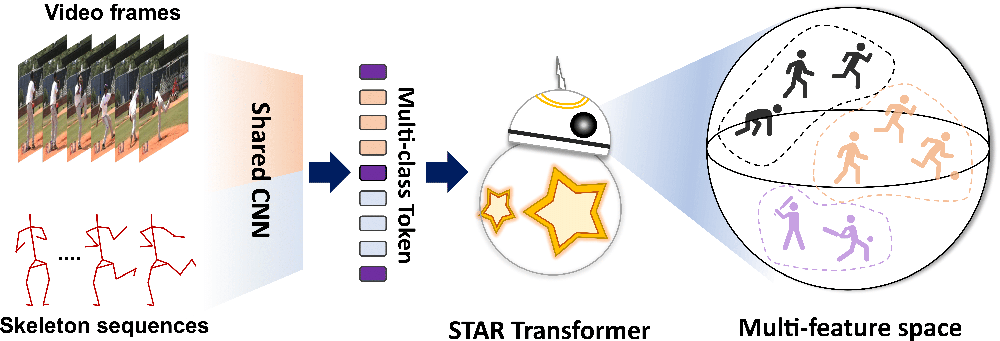
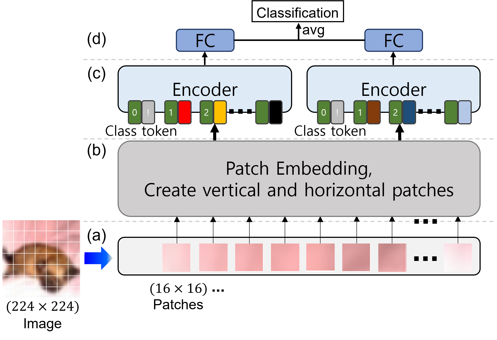

 I am a master's student in the Department of Computer Science and Engineering at Keimyung University.
 I am interested in computer vision and deep learning and doing research. 

 My current research is focused on:
   * Computation-efficient architectures that enable efficient and generic modeling for activity recognition

 
### Education
 - M.S., School of Computer Engineering, Keimyung University (2021.09 ~ ) - Advisor: Prof. Byoung Chul Ko
 - B.S., School of Computer Engineering, Keimyung University (2013.03 ~ 2018.02)

 
### Research Interest
 - Deep Learning, Computer Vision
 - Transformer
 - Facial emotion recognition, Image recognition
 - Video understanding (Action recognition, Temporal action detection, etc.)
 - Multi-modal learning

 
### News

* [2023/01] <a href='https://arxiv.org/abs/2210.07503'>STAR-Transformer</a> is accepted to <a href='https://wacv2023.thecvf.com/'>WACV 2023</a>.
* [2022/07] <a href='https://ieeexplore.ieee.org/document/9895100'>Shift-ViT</a> is accepted to <a href='https://www.itc-cscc2022.org/'>ITC-CSCC 2022</a>.

 
### Publications
(* indicates equal contribution)

 
<ul>
 <h4>  * Conference </h4>        
 <table style="width:100%;border:0px;border-spacing:0px;border-collapse:separate;margin-right:auto;margin-left:auto;font-size:12pt;text-indent: 30px;">
  <tbody>
     <tr>
       <td style="padding:20px;width:30%;max-width:30%" align="center">
         
       </td>
       <td width="75%" valign="center">
         <strong><u>
          
STAR-Transformer: A Spatio-temporal Cross Attention Transformer for Human Action Recognition

          </u></strong>
         <strong>Dasom Ahn</strong>, 
         <a href="https://jumpsnack.github.io/"> Sangwon Kim</a>, Hyunsu Hong, Byoung Chul Ko
          
         <em>Conference on IEEE/CVF Winter Conference on Applications of Computer Vision (<strong>WACV</strong>)</em>, 2023
          
         <a href="https://arxiv.org/abs/2210.07503">[arXiv]</a>
         <a href="https://openaccess.thecvf.com/content/WACV2023/papers/Ahn_STAR-Transformer_A_Spatio-Temporal_Cross_Attention_Transformer_for_Human_Action_Recognition_WACV_2023_paper.pdf">[CVF]</a> 
          
        </td>
     </tr>
     <tr>
       <td style="padding:20px;width:30%;max-width:30%" align="center">
         
       </td>
       <td width="75%" valign="center">
         <strong><u>
          
Shift-ViT: Siamese Vision Transformer using Shifted Branches

          </u></strong>
         <strong>Dasom Ahn</strong>, 
         Hyeongjin Kim, <a href="https://jumpsnack.github.io/"> Sangwon Kim</a>, Hyunsu Hong, Byoung Chul Ko
          
         <em>International Technical Conference o Circuits/Systems, Computers and Communications (<strong>ITC-CSCC</strong>)</em>, 2022
          
         <a href="https://ieeexplore.ieee.org/document/9895100">[IEEE Xplore]</a>                
              
        </td>
      </tr>
   </tbody>
 </table>             

  
 <h4>  * Domestic Papers   </h4>
  

  - <strong>Dasom Ahn</strong>, Sangwon Kim, Byoung Chul Ko, "Vision Transformer기반의 동적 얼굴 표정 인식 시스템", <em>2021 한국소프트웨어종합학술대회 (<strong>KSC2021</strong>)</em>, Dec. 2021    
  - <strong>Dasom Ahn</strong>, Sangwon Kim, Byoung Chul Ko, "교차 주의집중 트랜스포머를 이용한 인간 행동 인식 시스템", <em>2022 대한전자공학회 하계종합학술대회 (<strong>IEIE</strong>) [<strong>Best Paper Award</strong>]</em>, pp. 839-840, Jun. 2022      
  

</ul>

     
### Patents     
         
 
### Honor & Awards     
 - 2022 Best Paper: IEIE, S.Korea    
 - 2016 Best Paper: WISET, S.Korea      
     
  

