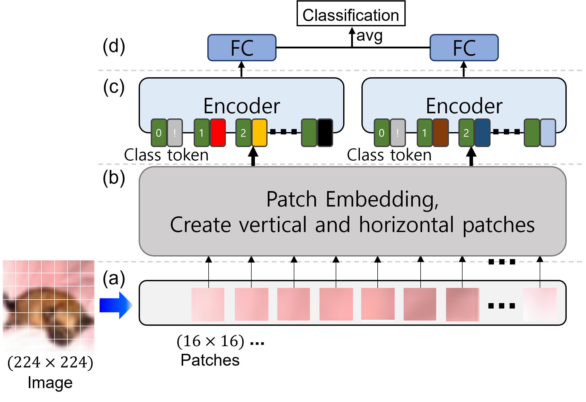

 I am a Ph.D. student in the Department of Computer Science and Engineering at Keimyung University.
 I am interested in computer vision and deep learning and doing research. 

 My current research is focused on:
   * Computation-efficient architectures that enable efficient and generic modeling for activity recognition
   * Explainable and concept-aware policy learning for robotics, aiming to improve interpretability, trustworthiness, and human understanding of robot decision-making

 
### Education
 - Ph.D., School of Computer Engineering, Keimyung University (2023.09 ~ )   - Advisor: Prof. Byoung Chul Ko
 - M.S., School of Computer Engineering, Keimyung University (2021.09 ~ 2023.08)   - Advisor: Prof. Byoung Chul Ko
 - B.S., School of Computer Engineering, Keimyung University (2013.03 ~ 2018.02)

 
### Research Interest
 - Deep Learning, Computer Vision
 - Transformer
 - Facial emotion recognition, Image recognition
 - Video understanding (Action recognition, Temporal action detection, etc.)
 - Multi-modal learning
 - eXplainable AI
 - Visuomotor policy

 
### News

* [2025/11] A paper is published to Neurocomputing.
* [2025/10] A paper is accepted by ICCVW 2025.
* [2024/12] A paper is accepted by ACCV 2024.
* [2024/07] A paper is accepted by ICML 2024.
* [2023/10] A paper is published to IEEE Access 2024.
* [2023/10] A paper is accepted by ICML 2024.
* [2023/10] A paper is published to Springer.
* [2023/10]  A paper is accepted by <a href='https://iccv2023.thecvf.com/'>ICCV 2023</a>.
* [2023/08] A paper is published to <a href='https://link.springer.com/article/10.1007/s10489-023-04978-7'>Springer Applied Intelligence</a>.
* [2023/01] <a href='https://arxiv.org/abs/2210.07503'>STAR-Transformer</a> is accepted to <a href='https://wacv2023.thecvf.com/'>WACV 2023</a>.
* [2022/07] <a href='https://ieeexplore.ieee.org/document/9895100'>Shift-ViT</a> is accepted to <a href='https://www.itc-cscc2022.org/'>ITC-CSCC 2022</a>.

 
### Publications
(* indicates equal contribution)

 
<ul>
 <h4>  * Conference </h4>        
 <table style="width:100%;border:0px;border-spacing:0px;border-collapse:separate;margin-right:auto;margin-left:auto;font-size:12pt;text-indent: 30px;">
  <tbody>

     <tr>
       <td style="padding:20px;width:30%;max-width:30%" align="center">
       </td>
       <td width="75%" valign="center">
         <strong>
          
Flow-Guided Policies: Overcoming Diffusion Limitations for Robust Robot Imitation Learning

          </strong>
          Chanhyuk Jung, Sangwon Kim, Kwang-Ju Kim, <strong>Dasom Ahn</strong>, Joonki Baek, Sungkeun Yoo, Byoung Chul Ko
          
         <em> International Conference on Computer Vision Workshops (<strong>ICCVW</strong>)</em>, 2025
          
         <a href="https://openaccess.thecvf.com/content/ICCV2025W/ACVR/html/Jung_Flow-Guided_Policies_Overcoming_Diffusion_Limitations_for_Robust_Robot_Imitation_Learning_ICCVW_2025_paper.html">[CVF]</a>
          
        </td>
     </tr>

     <tr>
       <td style="padding:20px;width:30%;max-width:30%" align="center">
       </td>
       <td width="75%" valign="center">
         <strong>
          
EQ-CBM: A Probabilistic Concept Bottleneck with Energy-based Models and Quantized Vectors

          </strong>
          Sangwon Kim, <strong>Dasom Ahn</strong>,  Byoung Chul Ko, In-su Jang, Kwang-Ju Kim
          
         <em> Asian Conference on Computer Vision (<strong>ACCV</strong>)</em>, 2024
          
         <a href="https://openaccess.thecvf.com/content/ACCV2024/papers/Kim_EQ-CBM_A_Probabilistic_Concept_Bottleneck_with_Energy-based_Models_and_Quantized_ACCV_2024_paper.pdf">[CVF]</a>
          
        </td>
     </tr>
   
     <tr>
       <td style="padding:20px;width:30%;max-width:30%" align="center">
       </td>
       <td width="75%" valign="center">
         <strong>
          
Scene Graph Generation Strategy with Co-occurrence Knowledge and Learnable Term Frequency

          </strong>
          Hyeongjin Kim, Sangwon Kim, <strong>Dasom Ahn</strong>, Jong Taek Lee, Byoung Chul Ko
          
         <em> International Conference on Machine Learning (<strong>ICML</strong>)</em>, 2024
          
         <a href="">[arXiv]</a>
          
        </td>
     </tr>
     
     <tr>
       <td style="padding:20px;width:30%;max-width:30%" align="center">
         
       </td>
       <td width="75%" valign="center">
         <strong>
          
Cross-Modal Learning with 3D Deformable Attention for Action Recognition

          </strong>
          Sangwon Kim, <strong>Dasom Ahn</strong>, Byoung Chul Ko
          
         <em> IEEE/CVF International Conference on Computer Vision (<strong>ICCV</strong>)</em>, 2023
          
         <a href="https://arxiv.org/pdf/2212.05638.pdf">[arXiv]</a>
          
        </td>
     </tr>
   
     <tr>
       <td style="padding:20px;width:30%;max-width:30%" align="center">
         
       </td>
       <td width="75%" valign="center">
         <strong>
          
STAR-Transformer: A Spatio-temporal Cross Attention Transformer for Human Action Recognition

          </strong>
         <strong>Dasom Ahn</strong>, 
          Sangwon Kim, Hyunsu Hong, Byoung Chul Ko
          
         <em> IEEE/CVF Winter Conference on Applications of Computer Vision (<strong>WACV</strong>)</em>, 2023
          
         <a href="https://arxiv.org/abs/2210.07503">[arXiv]</a>
         <a href="https://openaccess.thecvf.com/content/WACV2023/papers/Ahn_STAR-Transformer_A_Spatio-Temporal_Cross_Attention_Transformer_for_Human_Action_Recognition_WACV_2023_paper.pdf">[CVF]</a> 
          
        </td>
     </tr>
     
     <tr>
       <td style="padding:20px;width:30%;max-width:30%" align="center">
         
       </td>
       <td width="75%" valign="center">
         <strong>
          
Shift-ViT: Siamese Vision Transformer using Shifted Branches

          </strong>
         <strong>Dasom Ahn</strong>, 
         Hyeongjin Kim, Sangwon Kim, Hyunsu Hong, Byoung Chul Ko
          
         <em> International Technical Conference on Circuits/Systems, Computers and Communications (<strong>ITC-CSCC</strong>)</em>, 2022
          
         <a href="https://ieeexplore.ieee.org/document/9895100">[IEEE Xplore]</a>                
              
        </td>
      </tr>
   </tbody>
 </table>    

 

 <h4>  * Journal </h4>        
 <table style="width:100%;border:0px;border-spacing:0px;border-collapse:separate;margin-right:auto;margin-left:auto;font-size:12pt;text-indent: 30px;">
  <tbody>

     <tr>
       <td style="padding:20px;width:30%;max-width:30%" align="center">
         <!--img style="width:100%;max-width:100%" src="../img/3ddf.png" alt="dise"-->
       </td>
       <td width="75%" valign="center">
         <strong>
          
LAttE: A Label-Free and Multimodal Framework for Context-Aware Person Re-Identification

          </strong>
          <strong>Dasom Ahn</strong>, Sangwon Kim, Kwang-Ju Kim, Byoung Chul Ko
          
         <em> Neurocomputing (Elsevier) (Q1), Vo. 653, No. 7, pp. 1-9 </em>, 2025
          
         <a href='https://ieeexplore.ieee.org/document/10623143](https://www.sciencedirect.com/science/article/pii/S0925231225018442'>[Neurocomputing]</a>
          
        </td>
     </tr>
   
     <tr>
       <td style="padding:20px;width:30%;max-width:30%" align="center">
         <!--img style="width:100%;max-width:100%" src="../img/3ddf.png" alt="dise"-->
       </td>
       <td width="75%" valign="center">
         <strong>
          
Interpretable Information Visualization for Enhanced Temporal Action Detection In Videos

          </strong>
          <strong>Dasom Ahn</strong>, Jong-Ha Lee, Byoung Chul Ko
          
         <em> IEEE Access </em>, 2024
          
         <a href='https://ieeexplore.ieee.org/document/10623143'>[IEEE Access]</a>
          
        </td>
     </tr>
   
     <tr>
       <td style="padding:20px;width:30%;max-width:30%" align="center">
         <!--img style="width:100%;max-width:100%" src="../img/3ddf.png" alt="dise"-->
       </td>
       <td width="75%" valign="center">
         <strong>
          
BTD-RF: 3D Scene Reconstruction Using Block-Term Tensor Decomposition

          </strong>
          Seon Bin Kim, Sangwon Kim, <strong>Dasom Ahn</strong>, Byoung Chul Ko
          
         <em> Springer Applied Intelligence </em>, 2024
          
         <a href=''>[Springer]</a>
          
        </td>
     </tr>
   
     <tr>
       <td style="padding:20px;width:30%;max-width:30%" align="center">
         <!--img style="width:100%;max-width:100%" src="../img/3ddf.png" alt="dise"-->
       </td>
       <td width="75%" valign="center">
         <strong>
          
STAR++: Rethinking Spatio-Temporal Cross Attention Transformer for Video Action Recognition

          </strong>
          <strong>Dasom Ahn</strong>, Sangwon Kim, Byoung Chul Ko
          
         <em> Springer Applied Intelligence </em>, 2023
          
         <a href='https://link.springer.com/article/10.1007/s10489-023-04978-7'>[Springer]</a>
          
        </td>
     </tr>
   
   </tbody>
 </table>  

  
 <h4>  * Domestic Papers   </h4>
  
   <ul>

    - <strong>Dasom Ahn</strong>, Sangwon Kim, Byoung Chul Ko, "시간 기반 개념 표현을 활용한 설명가능한 로봇 정책 확산 제어 모델", <em>제 38회 영상처리 및 이해에 관산 워크샵 (<strong>IPIU2026</strong>)</em>, Feb. 2026
   
</ul>
   <ul>

    - <strong>Dasom Ahn</strong>, Sangwon Kim, Byoung Chul Ko, "설명 가능한 의사결정을 위한 에너지 기반 개념 병목 모델 설계", <em>제 36회 영상처리 및 이해에 관한 워크샵 (<strong>IPIU2024</strong>)</em>, Feb. 2024
   
</ul>
   <ul>

    - <strong>Dasom Ahn</strong>, Sangwon Kim, Byoung Chul Ko, "향상된 시간 특징 학습을 사용한 새로운 시간적 행동 인식 및 지역화 시스템", <em>제33회 인공지능신호처리합동학술대회 (<strong>AISP2023</strong>)</em>, Sep. 2023
   
</ul>
   <ul>

    - <strong>Dasom Ahn</strong>, Sangwon Kim, Byoung Chul Ko, "Vision Transformer기반의 동적 얼굴 표정 인식 시스템", <em>2021 한국소프트웨어종합학술대회 (<strong>KSC2021</strong>)</em>, Dec. 2021
   
</ul>
   <ul>

    - <strong>Dasom Ahn</strong>, Sangwon Kim, Byoung Chul Ko, "교차 주의집중 트랜스포머를 이용한 인간 행동 인식 시스템", <em>2022 대한전자공학회 하계종합학술대회 (<strong>IEIE</strong>) [<strong>Best Paper Award</strong>]</em>, pp. 839-840, Jun. 2022
   
</ul>      
   
</ul>

     
### Patents     
- 고병철, 안다솜, 김상원, 변이 브랜치를 사용한 샴 비전 변환기에 의한 이미지 분류 방법 및 장치 (IMAGE CLASSIFICATION METHOD AND APPARATUS BY SIAMESE VISION TRANSFORMER USING SHIFTED BRANCHES), 등록번호(일자) 1028922120000 (2025.11.24) (연구재단, 지역대학우수,2025 종료과제)
- 고병철, 안다솜, 비전 트랜스포머 기반의 얼굴 표정 인식장치 및 방법 (VISION TRANSFORMER-BASED FACIAL EXPRESSION RECOGNITION APPARATUS AND METHOD), 등록번호/일자 10-2780363 (2025.03.07) (연구재단, 지역대학우수,2019 종료과제)
- 고병철, 안다솜, 시공간 교차 주의집중 트랜스포머를 이용한 인간 행동 인식 시스템 및 방법(SPATIO-TEMPORAL CROSS ATTENTION TRANSFORMER SYSTEM AND METHOD FOR HUMAN ACTION RECOGNITION), 등록번호/일자 1027263850000 (2024.10.31) (연구재단, 지역대학우수,2025 종료과제)
         
 
### Honor & Awards     
 - 2023 Best Paper: AISP, S.Korea    
 - 2022 Best Paper: IEIE, S.Korea    
 - 2016 Best Paper: WISET, S.Korea 
